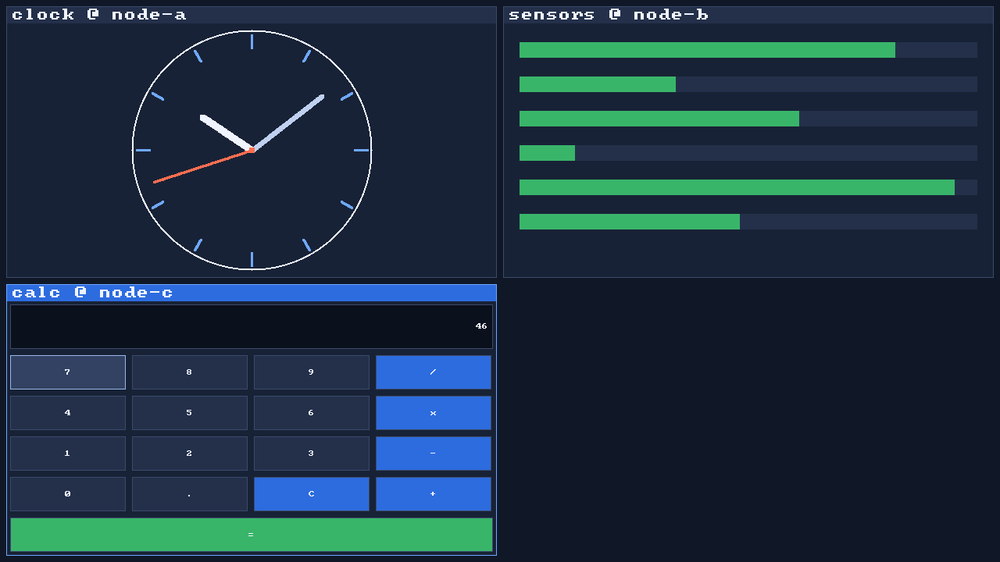
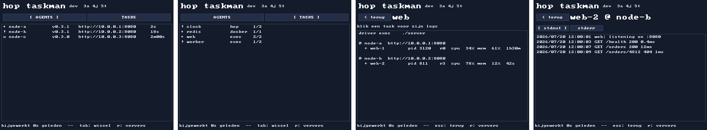
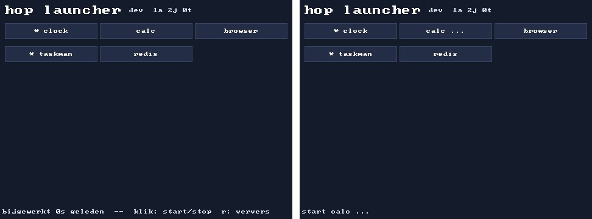
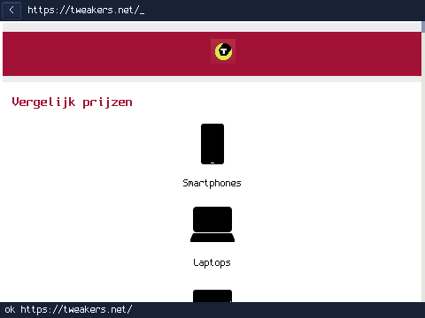
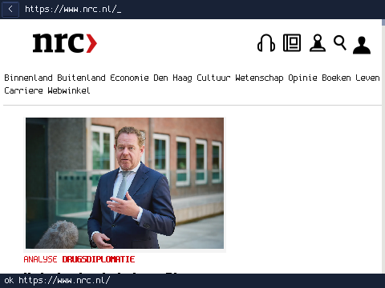
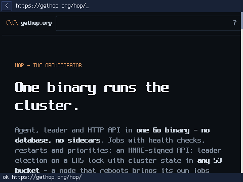
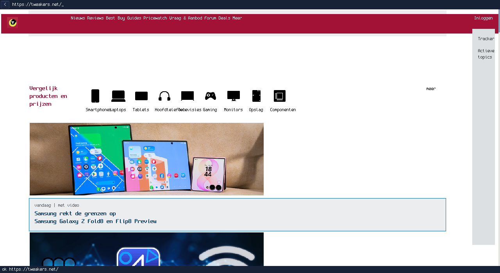
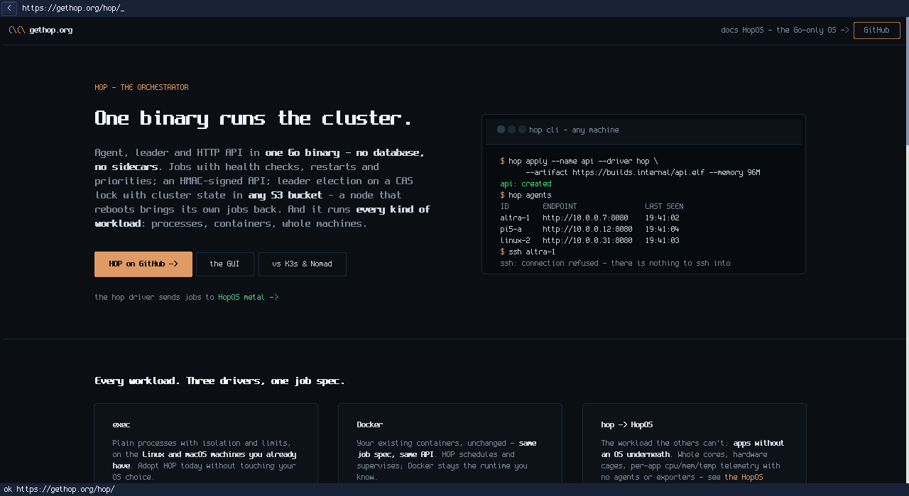

# SURF — the HopOS GUI stack

Network-transparent windows for [HopOS](https://github.com/xinix00/HopOS):
an app draws into an `image.RGBA` anywhere in the cluster, the display node
composites it as a window. Kill the node an app runs on and let HOP restart
it elsewhere — the window comes back by itself.



Everything in this repo is a **plain HopOS app** — the OS itself carries no
GUI code. Design dossier (the negotiated source of truth, Dutch):
[HopOS docs/gui-ontwerp.md](https://github.com/xinix00/HopOS/blob/main/docs/gui-ontwerp.md).

## Parts

| package | what |
|---|---|
| `stack/surf/` | the wire protocol: 8-byte header, HELLO/CREATE/DAMAGE/PRESENT/CONFIGURE/INPUT/CLOSE + SCENE/PATCH/EVENT (P2) |
| `stack/compositor/` | software compositor: tiling grid, title bars, double-buffered surfaces, cursor |
| `stack/surfserve/` | SURF sessions + the built-in web-KVM: `/screen.png` (headless screenshot) and `/kvm` (watch + mouse/keys from any browser); renders scene-surfaces display-side |
| `stack/window/` | the pixel app side: `window.Open`, draw, `Present()` — reconnects and resends a full frame on its own |
| `stack/scene/` | the retained widget layer (P2): send one binary tree, then byte-sized PATCHes; the display renders, re-flows and hit-tests — apps get semantic EVENTs (host-tested) |
| `stack/pixel/` | tiny shared drawing layer: the 8x8 font, fills, outlines |
| `app/ui/` | small app helpers: keycode→rune, short durations (host-tested) |
| `app/clock/` | the demo clock face |
| `app/calc/` | calculator logic + its scene tree (host-tested) |
| `app/browse/` | the browser: x/net/html DOM + cascadia selectors + own fetch/CSS/layout/rendering (host-tested) |
| `app/hopapi/` | client for HOP's `/v1` API with HMAC request signing — reads, `Apply`, `Delete` and SSE `Logs` (host-tested) |
| `app/taskman/` | taskmanager as a scene app: AGENTS/TASKS, per-job task details, live log tail per task (host-tested) |
| `app/launcher/` | launcher as a scene app: the boot-config app catalog as buttons, click toggles start/stop (host-tested) |
| `cmd/display` | the display server app (SURF on :7878, HTTP on :80) |
| `cmd/clock` | the pixel demo app: an analog clock from anywhere in the cluster |
| `cmd/calc` | scene app: the display renders the keypad, every keypress is one PATCH of the display value |
| `cmd/browser` | a real web browser (pixel app): `browse/` fetches, parses and lays out (`SURF_HOME` = start page) |
| `cmd/dash` | the P2 proof app: a dashboard that measures and shows its own wire traffic |
| `cmd/taskman` | the cluster watching itself: agents → jobs → tasks → live logs (SSE), each log line one PATCH (`HOP_ADDR=<node>:8080`, `HOP_KEY` = cluster API key, empty = no auth) |
| `cmd/launcher` | the desktop starting itself: buttons from `HOPOS_APPS` (the `hopos.apps[]` boot-config catalog, `{{host}}` resolved by HopOS — see HopOS `docs/config.md`); click starts, click again stops |

## Build & test

```sh
tools/test.sh        # host tests (incl. end-to-end window↔display) + tamago builds
```

Needs the [tamago toolchain](https://github.com/usbarmory/tamago-go) for the
app builds, and a checkout of HopOS next to this repo (`../hop-os` — see the
replace lines in `go.mod`). Artifacts land in `out/display.elf` and
`out/clock.elf`; submit them as HopOS jobs (see HopOS `docs/app.md`). The
clock finds its display through the job-spec env `SURF_ADDR=<display-node>:7878`.

Render the demo screenshots without any hardware:

```sh
SCREENSHOT_OUT=$PWD/docs/desktop-demo.png go test ./stack/surfserve -run Screenshot
SCREENSHOT_OUT=$PWD/docs/taskman.png go test ./app/taskman -run Screenshot
SCREENSHOT_OUT=$PWD/docs/launcher.png go test ./app/launcher -run Screenshot
```




The browser renders real news sites (live network — these refresh on
every test run that touches `app/browse`). Same page, two frame widths:
`@media` is evaluated against the real width, so 480 gets the mobile CSS
and 1280 the desktop layout (real flex/grid columns):

```sh
go test ./app/browse -run ScreenshotSites   # writes docs/browser-<site>[-desktop].png
```

The engine's living spec is [docs/browser-plan.md](docs/browser-plan.md):
every behaviour is a fixture in `app/browse/testdata/spec/` with its
expectations embedded, and `go test ./app/browse -run Spec` renders them all
(including the open `.todo` gaps) to
[docs/browser-spec.png](docs/browser-spec.png) — offline, every run.

| tweakers.net | nrc.nl | nu.nl | gethop.org/hop/ |
|---|---|---|---|
|  |  |  |  |






## Windows, not tiles

Floating windows: an app gets the size it asks for in CREATE and *keeps* it
— no tiling that shrinks everything whenever a window arrives. New windows
cascade; the title bar drags; click raises; the taskbar at the bottom has a
start button (it toggles the app that declared `CREATE.Role = menu` — the
launcher) and one button per window (click = raise, again = minimize).

CONFIGURE is still authoritative (the Wayland lesson): the WM grants the
hint, clamped to the work area — an oversized hint gets a smaller CONFIGURE
and the app re-renders. Damage at a stale size is silently dropped; a
presenting app converges on its own.

## Status

P1 (pixels + damage over TCP, software compositor with WM-driven sizing,
web-KVM) **and** P2: the scene layer is live — calc, taskman, launcher and
dash send a widget tree once and PATCH from there (bytes per update instead
of kilobytes), with display-side hit-testing, re-flow on resize and raw key
forwarding. The pixel path stays for pixel-native apps (clock's face, the
browser's page raster) — that is what it is for. Next: the canvas DAMAGE
pass-through (pixels inside a scene), the local zero-copy transport, and
the HVS plane path on the Raspberry Pi.
